```mermaid
flowchart LR
    input["📈 Input Series<br/>1-D array"] --> model["🤖 TimesFM<br/>compile + forecast"]
    model --> point["📍 Point Forecast<br/>(batch, horizon)"]
    model --> quant["📊 Quantile Forecast<br/>(batch, horizon, 10)"]
    quant --> pi80["80% PI<br/>q[:,:,1] – q[:,:,9]"]
    quant --> pi60["60% PI<br/>q[:,:,2] – q[:,:,8]"]
    quant --> median["Median<br/>q[:,:,5]"]

    classDef data fill:#dbeafe,stroke:#2563eb,stroke-width:2px,color:#1e3a5f
    classDef model fill:#f3e8ff,stroke:#9333ea,stroke-width:2px,color:#581c87
    classDef output fill:#dcfce7,stroke:#16a34a,stroke-width:2px,color:#14532d

    class input data
    class model model
    class point,quant,pi80,pi60,median output
```

# TimesFM — AI Agent Skill

> Contributed by Clayton Young / Superior Byte Works, LLC ([@borealBytes](https://github.com/borealBytes))
> Apache 2.0 — same license as this repository

This file is automatically loaded by AI coding agents (Claude Code / OpenCode / Cursor / Codex) when
you open this repository. It teaches your agent how to use TimesFM correctly — safe model loading,
the right API calls, covariate workflows, anomaly detection, and how to avoid the most common bugs.

---

## Overview

TimesFM (Time Series Foundation Model) is a pretrained decoder-only foundation model developed by
Google Research for time-series forecasting. It works **zero-shot** — feed it any univariate time
series and it returns point forecasts with calibrated quantile prediction intervals, no training
required.

This skill includes a **mandatory preflight system checker** that verifies RAM, GPU memory, and
disk space before the model is ever loaded so the agent never crashes the user's machine.

> **Key numbers**: TimesFM 2.5 uses 200M parameters (~800 MB on disk, ~1.5 GB in RAM on CPU,
> ~1 GB VRAM on GPU). The archived v1/v2 500M-parameter model needs ~32 GB RAM. Always run the
> system checker first.

## When to Use This Skill

Use this skill when:

- Forecasting **any univariate time series** (sales, demand, sensor, vitals, price, weather)
- You need **zero-shot forecasting** without training a custom model
- You want **probabilistic forecasts** with calibrated prediction intervals (quantiles)
- You have time series of **any length** (the model handles 1–16,384 context points)
- You need to **batch-forecast** hundreds or thousands of series efficiently
- You want a **foundation model** approach instead of hand-tuning ARIMA/ETS parameters

Do **not** use this skill when:

- You need classical statistical models with coefficient interpretation → use `statsmodels`
- You need time series classification or clustering → use `aeon`
- You need multivariate vector autoregression or Granger causality → use `statsmodels`
- Your data is tabular (not temporal) → use `scikit-learn`

> **Note on Anomaly Detection**: TimesFM does not have built-in anomaly detection, but you can
> use the **quantile forecasts as prediction intervals** — values outside the 90% CI (q10–q90)
> are statistically unusual. See `claude-skill/examples/anomaly-detection/` for a full example.

---

## ⚠️ Mandatory Preflight: System Requirements Check

**CRITICAL — ALWAYS run the system checker before loading the model for the first time.**

```bash
python claude-skill/scripts/check_system.py
```

This script checks:

1. **Available RAM** — warns if below 4 GB, blocks if below 2 GB
2. **GPU availability** — detects CUDA/MPS devices and VRAM
3. **Disk space** — verifies room for the ~800 MB model download
4. **Python version** — requires 3.10+
5. **Existing installation** — checks if `timesfm` and `torch` are installed

> **Note:** Model weights are **NOT stored in this repository**. TimesFM weights (~800 MB)
> download on-demand from HuggingFace on first use and cache in `~/.cache/huggingface/`.
> The preflight checker ensures sufficient resources before any download begins.

```mermaid
flowchart TD
    start["🚀 Run check_system.py"] --> ram{"RAM ≥ 4 GB?"}
    ram -->|"Yes"| gpu{"GPU available?"}
    ram -->|"No (2-4 GB)"| warn_ram["⚠️ Warning: tight RAM<br/>CPU-only, small batches"]
    ram -->|"No (< 2 GB)"| block["🛑 BLOCKED<br/>Insufficient memory"]
    warn_ram --> disk
    gpu -->|"CUDA / MPS"| vram{"VRAM ≥ 2 GB?"}
    gpu -->|"CPU only"| cpu_ok["✅ CPU mode<br/>Slower but works"]
    vram -->|"Yes"| gpu_ok["✅ GPU mode<br/>Fast inference"]
    vram -->|"No"| cpu_ok
    gpu_ok --> disk{"Disk ≥ 2 GB free?"}
    cpu_ok --> disk
    disk -->|"Yes"| ready["✅ READY<br/>Safe to load model"]
    disk -->|"No"| block_disk["🛑 BLOCKED<br/>Need space for weights"]

    classDef ok fill:#dcfce7,stroke:#16a34a,stroke-width:2px,color:#14532d
    classDef warn fill:#fef9c3,stroke:#ca8a04,stroke-width:2px,color:#713f12
    classDef block fill:#fee2e2,stroke:#dc2626,stroke-width:2px,color:#7f1d1d
    classDef neutral fill:#f3f4f6,stroke:#6b7280,stroke-width:2px,color:#1f2937

    class ready,gpu_ok,cpu_ok ok
    class warn_ram warn
    class block,block_disk block
    class start,ram,gpu,vram,disk neutral
```



### Hardware Requirements by Model Version

| Model | Parameters | RAM (CPU) | VRAM (GPU) | Disk | Context |
| ----- | ---------- | --------- | ---------- | ---- | ------- |
| **TimesFM 2.5** (recommended) | 200M | ≥ 4 GB | ≥ 2 GB | ~800 MB | up to 16,384 |
| TimesFM 2.0 (archived) | 500M | ≥ 16 GB | ≥ 8 GB | ~2 GB | up to 2,048 |
| TimesFM 1.0 (archived) | 200M | ≥ 8 GB | ≥ 4 GB | ~800 MB | up to 2,048 |

> **Recommendation**: Always use TimesFM 2.5 unless you have a specific reason to use an
> older checkpoint. It is smaller, faster, and supports 8× longer context.

---

## 🔧 Installation

### Step 1: Verify System (always first)

```bash
python claude-skill/scripts/check_system.py
```

### Step 2: Install TimesFM

```bash
# Using uv (fast)
uv pip install timesfm[torch]

# Or using pip
pip install timesfm[torch]

# For JAX/Flax backend (faster on TPU/GPU)
uv pip install timesfm[flax]
```

### Step 3: Install PyTorch for Your Hardware

```bash
# CUDA 12.1 (NVIDIA GPU)
pip install torch>=2.0.0 --index-url https://download.pytorch.org/whl/cu121

# CPU only
pip install torch>=2.0.0 --index-url https://download.pytorch.org/whl/cpu

# Apple Silicon (MPS)
pip install torch>=2.0.0  # MPS support is built-in
```

### Step 4: Verify Installation

```python
import timesfm
import numpy as np
print(f"TimesFM version: {timesfm.__version__}")
print("Installation OK")
```

---

## 🎯 Quick Start

### Minimal Example (5 Lines)

```python
import torch, numpy as np, timesfm

torch.set_float32_matmul_precision("high")

model = timesfm.TimesFM_2p5_200M_torch.from_pretrained(
    "google/timesfm-2.5-200m-pytorch"
)
model.compile(timesfm.ForecastConfig(
    max_context=1024, max_horizon=256, normalize_inputs=True,
    use_continuous_quantile_head=True, force_flip_invariance=True,
    infer_is_positive=True, fix_quantile_crossing=True,
))

point, quantiles = model.forecast(horizon=24, inputs=[
    np.sin(np.linspace(0, 20, 200)),  # any 1-D array
])
# point.shape == (1, 24)         — median forecast
# quantiles.shape == (1, 24, 10) — 10th–90th percentile bands
```

### Forecast from CSV

```python
import pandas as pd, numpy as np

df = pd.read_csv("monthly_sales.csv", parse_dates=["date"], index_col="date")

# Convert each column to a list of arrays
inputs = [df[col].dropna().values.astype(np.float32) for col in df.columns]

point, quantiles = model.forecast(horizon=12, inputs=inputs)

# Build a results DataFrame
for i, col in enumerate(df.columns):
    last_date = df[col].dropna().index[-1]
    future_dates = pd.date_range(last_date, periods=13, freq="MS")[1:]
    forecast_df = pd.DataFrame({
        "date": future_dates,
        "forecast": point[i],
        "lower_80": quantiles[i, :, 2],  # 20th percentile
        "upper_80": quantiles[i, :, 8],  # 80th percentile
    })
    print(f"\n--- {col} ---")
    print(forecast_df.to_string(index=False))
```

### Forecast with Covariates (XReg)

TimesFM 2.5+ supports exogenous variables through `forecast_with_covariates()`. Requires `timesfm[xreg]`.

```python
# Requires: pip install timesfm[xreg]
point, quantiles = model.forecast_with_covariates(
    inputs=inputs,
    dynamic_numerical_covariates={"price": price_arrays},
    dynamic_categorical_covariates={"holiday": holiday_arrays},
    static_categorical_covariates={"region": region_labels},
    xreg_mode="xreg + timesfm",  # or "timesfm + xreg"
)
```

| Covariate Type | Description | Example |
| -------------- | ----------- | ------- |
| `dynamic_numerical` | Time-varying numeric | price, temperature, promotion spend |
| `dynamic_categorical` | Time-varying categorical | holiday flag, day of week |
| `static_numerical` | Per-series numeric | store size, account age |
| `static_categorical` | Per-series categorical | store type, region, product category |

**XReg Modes:**
- `"xreg + timesfm"` (default): TimesFM forecasts first, then XReg adjusts residuals
- `"timesfm + xreg"`: XReg fits first, then TimesFM forecasts residuals

> See `claude-skill/examples/covariates-forecasting/` for a complete example with synthetic retail data.

### Anomaly Detection (via Quantile Intervals)

TimesFM does not have built-in anomaly detection, but the **quantile forecasts naturally provide
prediction intervals** that can detect anomalies:

```python
point, q = model.forecast(horizon=H, inputs=[values])

# 90% prediction interval
lower_90 = q[0, :, 1]  # 10th percentile
upper_90 = q[0, :, 9]  # 90th percentile

# Detect anomalies: values outside the 90% CI
actual = test_values  # your holdout data
anomalies = (actual < lower_90) | (actual > upper_90)

# Severity levels
is_warning = (actual < q[0, :, 2]) | (actual > q[0, :, 8])  # outside 80% CI
is_critical = anomalies  # outside 90% CI
```

| Severity | Condition | Interpretation |
| -------- | --------- | -------------- |
| **Normal** | Inside 80% CI | Expected behavior |
| **Warning** | Outside 80% CI | Unusual but possible |
| **Critical** | Outside 90% CI | Statistically rare (< 10% probability) |

> See `claude-skill/examples/anomaly-detection/` for a complete example with visualization.

---

## 📊 Understanding the Output

### Quantile Forecast Structure

TimesFM returns `(point_forecast, quantile_forecast)`:

- **`point_forecast`**: shape `(batch, horizon)` — the median (0.5 quantile)
- **`quantile_forecast`**: shape `(batch, horizon, 10)` — ten slices:

| Index | Quantile | Use |
| ----- | -------- | --- |
| 0 | Mean | Average prediction |
| 1 | 0.1 | Lower bound of 80% PI |
| 2 | 0.2 | Lower bound of 60% PI |
| 3 | 0.3 | — |
| 4 | 0.4 | — |
| **5** | **0.5** | **Median (= `point_forecast`)** |
| 6 | 0.6 | — |
| 7 | 0.7 | — |
| 8 | 0.8 | Upper bound of 60% PI |
| 9 | 0.9 | Upper bound of 80% PI |

### Extracting Prediction Intervals

```python
point, q = model.forecast(horizon=H, inputs=data)

# 80% prediction interval (most common)
lower_80 = q[:, :, 1]  # 10th percentile
upper_80 = q[:, :, 9]  # 90th percentile

# 60% prediction interval (tighter)
lower_60 = q[:, :, 2]  # 20th percentile
upper_60 = q[:, :, 8]  # 80th percentile

# Median (same as point forecast)
median = q[:, :, 5]
```



---

## 🔧 ForecastConfig Reference

All forecasting behavior is controlled by `timesfm.ForecastConfig`:

```python
timesfm.ForecastConfig(
    max_context=1024,                    # Max context window (truncates longer series)
    max_horizon=256,                     # Max forecast horizon
    normalize_inputs=True,               # Normalize inputs (RECOMMENDED for stability)
    per_core_batch_size=32,              # Batch size per device (tune for memory)
    use_continuous_quantile_head=True,   # Better quantile accuracy for long horizons
    force_flip_invariance=True,          # Ensures f(-x) = -f(x) (mathematical consistency)
    infer_is_positive=True,              # Clamp forecasts ≥ 0 when all inputs > 0
    fix_quantile_crossing=True,          # Ensure q10 ≤ q20 ≤ ... ≤ q90
    return_backcast=False,               # Return backcast (for covariate workflows)
)
```

| Parameter | Default | When to Change |
| --------- | ------- | -------------- |
| `max_context` | 0 | Set to match your longest historical window (e.g., 512, 1024, 4096) |
| `max_horizon` | 0 | Set to your maximum forecast length |
| `normalize_inputs` | False | **Always set True** — prevents scale-dependent instability |
| `per_core_batch_size` | 1 | Increase for throughput; decrease if OOM |
| `use_continuous_quantile_head` | False | **Set True** for calibrated prediction intervals |
| `force_flip_invariance` | True | Keep True unless profiling shows it hurts |
| `infer_is_positive` | True | Set False for series that can be negative (temperature, returns) |
| `fix_quantile_crossing` | False | **Set True** to guarantee monotonic quantiles |

---

## 📋 Common Workflows

### Workflow 1: Single Series Forecast

```mermaid
flowchart TD
    check["1. Run check_system.py"] --> load["2. Load model<br/>from_pretrained()"]
    load --> compile["3. Compile with ForecastConfig"]
    compile --> prep["4. Prepare data<br/>pd.read_csv → np.array"]
    prep --> forecast["5. model.forecast()<br/>horizon=N"]
    forecast --> extract["6. Extract point + PI"]
    extract --> plot["7. Plot or export results"]

    classDef step fill:#f3f4f6,stroke:#6b7280,stroke-width:2px,color:#1f2937
    class check,load,compile,prep,forecast,extract,plot step
```



```python
import torch, numpy as np, pandas as pd, timesfm

# 1. System check (run once)
# python claude-skill/scripts/check_system.py

# 2-3. Load and compile
torch.set_float32_matmul_precision("high")
model = timesfm.TimesFM_2p5_200M_torch.from_pretrained(
    "google/timesfm-2.5-200m-pytorch"
)
model.compile(timesfm.ForecastConfig(
    max_context=512, max_horizon=52, normalize_inputs=True,
    use_continuous_quantile_head=True, fix_quantile_crossing=True,
))

# 4. Prepare data
df = pd.read_csv("weekly_demand.csv", parse_dates=["week"])
values = df["demand"].values.astype(np.float32)

# 5. Forecast
point, quantiles = model.forecast(horizon=52, inputs=[values])

# 6. Extract prediction intervals
forecast_df = pd.DataFrame({
    "forecast": point[0],
    "lower_80": quantiles[0, :, 1],
    "upper_80": quantiles[0, :, 9],
})

# 7. Plot
import matplotlib
matplotlib.use("Agg")
import matplotlib.pyplot as plt
fig, ax = plt.subplots(figsize=(12, 5))
ax.plot(values[-104:], label="Historical")
x_fc = range(len(values[-104:]), len(values[-104:]) + 52)
ax.plot(x_fc, forecast_df["forecast"], label="Forecast", color="tab:orange")
ax.fill_between(x_fc, forecast_df["lower_80"], forecast_df["upper_80"],
                alpha=0.2, color="tab:orange", label="80% PI")
ax.legend()
ax.set_title("52-Week Demand Forecast")
plt.tight_layout()
plt.savefig("forecast.png", dpi=150)
print("Saved forecast.png")
```

### Workflow 2: Batch Forecasting (Many Series)

```python
import pandas as pd, numpy as np

# Load wide-format CSV (one column per series)
df = pd.read_csv("all_stores.csv", parse_dates=["date"], index_col="date")
inputs = [df[col].dropna().values.astype(np.float32) for col in df.columns]

# Forecast all series at once (batched internally)
point, quantiles = model.forecast(horizon=30, inputs=inputs)

# Collect results
results = {}
for i, col in enumerate(df.columns):
    results[col] = {
        "forecast": point[i].tolist(),
        "lower_80": quantiles[i, :, 1].tolist(),
        "upper_80": quantiles[i, :, 9].tolist(),
    }

# Export
import json
with open("batch_forecasts.json", "w") as f:
    json.dump(results, f, indent=2)
print(f"Forecasted {len(results)} series → batch_forecasts.json")
```

### Workflow 3: Evaluate Forecast Accuracy

```python
import numpy as np

# Hold out the last H points for evaluation
H = 24
train = values[:-H]
actual = values[-H:]

point, quantiles = model.forecast(horizon=H, inputs=[train])
pred = point[0]

# Metrics
mae = np.mean(np.abs(actual - pred))
rmse = np.sqrt(np.mean((actual - pred) ** 2))
mape = np.mean(np.abs((actual - pred) / actual)) * 100

# Prediction interval coverage
lower = quantiles[0, :, 1]
upper = quantiles[0, :, 9]
coverage = np.mean((actual >= lower) & (actual <= upper)) * 100

print(f"MAE:  {mae:.2f}")
print(f"RMSE: {rmse:.2f}")
print(f"MAPE: {mape:.1f}%")
print(f"80% PI Coverage: {coverage:.1f}% (target: 80%)")
```

---

## ⚙️ Performance Tuning

### GPU Acceleration

```python
import torch

# Check GPU availability
if torch.cuda.is_available():
    print(f"GPU: {torch.cuda.get_device_name(0)}")
    print(f"VRAM: {torch.cuda.get_device_properties(0).total_mem / 1e9:.1f} GB")
elif hasattr(torch.backends, "mps") and torch.backends.mps.is_available():
    print("Apple Silicon MPS available")
else:
    print("CPU only — inference will be slower but still works")

# Always set this for Ampere+ GPUs (A100, RTX 3090, etc.)
torch.set_float32_matmul_precision("high")
```

### Batch Size Tuning

```python
# Start conservative, increase until OOM
# GPU with 8 GB VRAM:  per_core_batch_size=64
# GPU with 16 GB VRAM: per_core_batch_size=128
# GPU with 24 GB VRAM: per_core_batch_size=256
# CPU with 8 GB RAM:   per_core_batch_size=8
# CPU with 16 GB RAM:  per_core_batch_size=32
# CPU with 32 GB RAM:  per_core_batch_size=64

model.compile(timesfm.ForecastConfig(
    max_context=1024,
    max_horizon=256,
    per_core_batch_size=32,  # <-- tune this
    normalize_inputs=True,
    use_continuous_quantile_head=True,
    fix_quantile_crossing=True,
))
```

### Memory-Constrained Environments

```python
import gc, torch

# Force garbage collection before loading
gc.collect()
if torch.cuda.is_available():
    torch.cuda.empty_cache()

# Load model
model = timesfm.TimesFM_2p5_200M_torch.from_pretrained(
    "google/timesfm-2.5-200m-pytorch"
)

# Use small batch size on low-memory machines
model.compile(timesfm.ForecastConfig(
    max_context=512,        # Reduce context if needed
    max_horizon=128,        # Reduce horizon if needed
    per_core_batch_size=4,  # Small batches
    normalize_inputs=True,
    use_continuous_quantile_head=True,
    fix_quantile_crossing=True,
))

# Process series in chunks to avoid OOM
CHUNK = 50
all_results = []
for i in range(0, len(inputs), CHUNK):
    chunk = inputs[i:i+CHUNK]
    p, q = model.forecast(horizon=H, inputs=chunk)
    all_results.append((p, q))
    gc.collect()  # Clean up between chunks
```

---

## 📚 Available Scripts

### `claude-skill/scripts/check_system.py`

**Mandatory preflight checker.** Run before first model load.

```bash
python claude-skill/scripts/check_system.py
```

Output example:
```
=== TimesFM System Requirements Check ===

[RAM]       Total: 32.0 GB | Available: 24.3 GB  ✅ PASS
[GPU]       NVIDIA RTX 4090 | VRAM: 24.0 GB      ✅ PASS
[Disk]      Free: 142.5 GB                        ✅ PASS
[Python]    3.12.1                                 ✅ PASS
[timesfm]   Installed (2.5.0)                      ✅ PASS
[torch]     Installed (2.4.1+cu121)                ✅ PASS

VERDICT: ✅ System is ready for TimesFM 2.5 (GPU mode)
Recommended: per_core_batch_size=128
```

### `claude-skill/scripts/forecast_csv.py`

End-to-end CSV forecasting with automatic system check.

```bash
python claude-skill/scripts/forecast_csv.py input.csv \
    --horizon 24 \
    --date-col date \
    --value-cols sales,revenue \
    --output forecasts.csv
```

---

## 📖 Reference Documentation

Detailed guides in `claude-skill/references/`:

| File | Contents |
| ---- | -------- |
| `references/system_requirements.md` | Hardware tiers, GPU/CPU selection, memory estimation formulas |
| `references/api_reference.md` | Full `ForecastConfig` docs, `from_pretrained` options, output shapes |
| `references/data_preparation.md` | Input formats, NaN handling, CSV loading, covariate setup |

---

## 🧪 Examples

Three fully-working reference examples live in `claude-skill/examples/`. Use them as ground truth
for correct API usage and expected output shape.

| Example | Directory | What It Demonstrates | When To Use It |
| ------- | --------- | -------------------- | -------------- |
| **Global Temperature Forecast** | `examples/global-temperature/` | Basic `model.forecast()` call, CSV → PNG → GIF pipeline, 36-month NOAA context | Starting point; copy-paste baseline for any univariate series |
| **Anomaly Detection** | `examples/anomaly-detection/` | Two-phase detection: linear detrend + Z-score on context, quantile PI on forecast; 2-panel viz | Any task requiring outlier detection on historical + forecasted data |
| **Covariates (XReg)** | `examples/covariates-forecasting/` | `forecast_with_covariates()` API (TimesFM 2.5), covariate decomposition, 2×2 shared-axis viz | Retail, energy, or any series with known exogenous drivers |

### Running the Examples

```bash
# Global temperature (basic forecast + visualization)
cd claude-skill/examples/global-temperature && python run_forecast.py && python visualize_forecast.py

# Anomaly detection (two-phase: detrend + Z-score on context, quantile PI on forecast)
cd claude-skill/examples/anomaly-detection && python detect_anomalies.py

# Covariates (API demo — requires timesfm[xreg] for real inference)
cd claude-skill/examples/covariates-forecasting && python demo_covariates.py
```

### Expected Outputs

| Example | Key output files | Acceptance criteria |
| ------- | ---------------- | ------------------- |
| global-temperature | `output/forecast_output.json`, `output/forecast_visualization.png` | `point_forecast` has 12 values; PNG shows context + forecast + PI bands |
| anomaly-detection | `output/anomaly_detection.json`, `output/anomaly_detection.png` | Sep 2023 flagged CRITICAL (z >= 3.0); >= 2 forecast CRITICAL from injected anomalies |
| covariates-forecasting | `output/sales_with_covariates.csv`, `output/covariates_data.png` | CSV has 108 rows (3 stores × 36 weeks); stores have **distinct** price arrays |

---

## Common Pitfalls

1. **Not running system check** → model load crashes on low-RAM machines. Always run `check_system.py` first.
2. **Forgetting `model.compile()`** → `RuntimeError: Model is not compiled`. Must call `compile()` before `forecast()`.
3. **Not setting `normalize_inputs=True`** → unstable forecasts for series with large values.
4. **Using v1/v2 on machines with < 32 GB RAM** → use TimesFM 2.5 (200M params) instead.
5. **Not setting `fix_quantile_crossing=True`** → quantiles may not be monotonic (q10 > q50).
6. **Huge `per_core_batch_size` on small GPU** → CUDA OOM. Start small, increase.
7. **Passing 2-D arrays** → TimesFM expects a **list of 1-D arrays**, not a 2-D matrix.
8. **Forgetting `torch.set_float32_matmul_precision("high")`** → slower inference on Ampere+ GPUs.
9. **Not handling NaN in output** → edge cases with very short series. Always check `np.isnan(point).any()`.
10. **Using `infer_is_positive=True` for series that can be negative** → clamps forecasts at zero. Set False for temperature, returns, etc.

---

## Model Versions


| Version | Params | Context | Quantile Head | Frequency Flag | Status |
| ------- | ------ | ------- | ------------- | -------------- | ------ |
| **2.5** | 200M | 16,384 | ✅ Continuous (30M) | ❌ Removed | **Latest** |
| 2.0 | 500M | 2,048 | ✅ Fixed buckets | ✅ Required | Archived |
| 1.0 | 200M | 2,048 | ✅ Fixed buckets | ✅ Required | Archived |

**Hugging Face checkpoints:**

- `google/timesfm-2.5-200m-pytorch` (recommended)
- `google/timesfm-2.5-200m-flax`
- `google/timesfm-2.0-500m-pytorch` (archived)
- `google/timesfm-1.0-200m-pytorch` (archived)

---

## Resources

- **Paper**: [A Decoder-Only Foundation Model for Time-Series Forecasting](https://arxiv.org/abs/2310.10688) (ICML 2024)
- **Repository**: https://github.com/google-research/timesfm
- **Hugging Face**: https://huggingface.co/collections/google/timesfm-release-66e4be5fdb56e960c1e482a6
- **Google Blog**: https://research.google/blog/a-decoder-only-foundation-model-for-time-series-forecasting/
- **BigQuery Integration**: https://cloud.google.com/bigquery/docs/timesfm-model

---

## Quality Checklist

Run this checklist after every TimesFM task before declaring success:

- [ ] **Output shape correct** — `point_fc` shape is `(n_series, horizon)`, `quant_fc` is `(n_series, horizon, 10)`
- [ ] **Quantile indices** — index 0 = mean, 1 = q10, 2 = q20 ... 9 = q90. **NOT** 0 = q0, 1 = q10.
- [ ] **Frequency flag** — TimesFM 1.0/2.0: pass `freq=[0]` for monthly data. TimesFM 2.5: no freq flag.
- [ ] **Series length** — context must be >= 32 data points (model minimum). Warn if shorter.
- [ ] **No NaN** — `np.isnan(point_fc).any()` should be False. Check input series for gaps first.
- [ ] **Visualization axes** — if multiple panels share data, use `sharex=True`. All time axes must cover the same span.
- [ ] **Binary outputs tracked** — PNG and GIF files should be tracked via Git LFS (`.gitattributes`).
- [ ] **No large datasets committed** — any real dataset > 1 MB should be downloaded to `tempfile.mkdtemp()` and annotated in code.
- [ ] **`matplotlib.use('Agg')`** — must appear before any pyplot import when running headless.
- [ ] **`infer_is_positive`** — set `False` for temperature anomalies, financial returns, or any series that can be negative.

---

## Common Mistakes

These bugs appeared during development. Learn from them:

1. **Quantile index off-by-one** — The most common mistake. `quant_fc[..., 0]` is the **mean**, not q0. q10 = index 1, q90 = index 9. Always define named constants: `IDX_Q10, IDX_Q20, IDX_Q80, IDX_Q90 = 1, 2, 8, 9`.

2. **Variable shadowing in comprehensions** — If you build per-series covariate dicts inside a loop, do NOT use the loop variable as the comprehension variable. Accumulate into separate `dict[str, ndarray]` outside the loop, then assign.
   ```python
   # WRONG — outer `store_id` gets shadowed:
   covariates = {store_id: arr[store_id] for store_id in stores}  # inside outer loop over store_id
   # CORRECT — use a different name or accumulate beforehand:
   prices_by_store: dict[str, np.ndarray] = {}
   for store_id, config in stores.items():
       prices_by_store[store_id] = compute_price(config)
   ```

3. **Wrong CSV column name** — The global-temperature CSV uses `anomaly_c`, not `anomaly`. Always `print(df.columns)` before accessing.

4. **`tight_layout()` warning with `sharex=True`** — Harmless; suppress with `plt.tight_layout(rect=[0, 0, 1, 0.97])` or ignore.

5. **TimesFM 2.5 required for `forecast_with_covariates()`** — TimesFM 1.0 does NOT have this method. Install `pip install timesfm[xreg]` and use checkpoint `google/timesfm-2.5-200m-pytorch`.

6. **Future covariates must span the full horizon** — Dynamic covariates (price, promotions, holidays) must have values for BOTH the context AND the forecast horizon. You cannot pass context-only arrays.

7. **Anomaly thresholds must be defined once** — Define `CRITICAL_Z = 3.0`, `WARNING_Z = 2.0` as module-level constants. Never hardcode `3` or `2` inline.

8. **Context anomaly detection uses residuals, not raw values** — Always detrend first (`np.polyfit` linear, or seasonal decomposition), then Z-score the residuals. Raw-value Z-scores are misleading on trending data.

---

## Validation & Verification

Use the example outputs as regression baselines. If you change forecasting logic, verify:

```bash
# Anomaly detection regression check:
python -c "
import json
d = json.load(open('claude-skill/examples/anomaly-detection/output/anomaly_detection.json'))
ctx = d['context_summary']
assert ctx['critical'] >= 1, 'Sep 2023 must be CRITICAL'
assert any(r['date'] == '2023-09' and r['severity'] == 'CRITICAL'
           for r in d['context_detections']), 'Sep 2023 not found'
print('Anomaly detection regression: PASS')"

# Covariates regression check:
python -c "
import pandas as pd
df = pd.read_csv('claude-skill/examples/covariates-forecasting/output/sales_with_covariates.csv')
assert len(df) == 108, f'Expected 108 rows, got {len(df)}'
prices = df.groupby('store_id')['price'].mean()
assert prices['store_A'] > prices['store_B'] > prices['store_C'], 'Store price ordering wrong'
print('Covariates regression: PASS')"
```
