# TimesFM Forecasting

## Overview

TimesFM (Time Series Foundation Model) is a pretrained decoder-only foundation model
developed by Google Research for time-series forecasting. It works **zero-shot** — feed it
any univariate time series and it returns point forecasts with calibrated quantile
prediction intervals, no training required.

This skill includes a **mandatory preflight system checker** that verifies RAM, GPU memory,
and disk space before the model is ever loaded so the agent never crashes the user's machine.

> **Key numbers**: TimesFM 2.5 uses 200M parameters (~800 MB on disk, ~1.5 GB in RAM on
> CPU, ~1 GB VRAM on GPU). The archived v1/v2 500M-parameter model needs ~32 GB RAM.
> Always run the system checker first.

## When to Use This Skill

Use this skill when:

- Forecasting **any univariate time series** (sales, demand, sensor, vitals, price, weather)
- You need **zero-shot forecasting** without training a custom model
- You want **probabilistic forecasts** with calibrated prediction intervals (quantiles)
- You have time series of **any length** (the model handles 1–16,384 context points)
- You need to **batch-forecast** hundreds or thousands of series efficiently
- You want a **foundation model** approach instead of hand-tuning ARIMA/ETS parameters

Do **not** use this skill when:

- You need classical statistical models with coefficient interpretation → use `statsmodels`
- You need time series classification or clustering → use `aeon`
- You need multivariate vector autoregression or Granger causality → use `statsmodels`
- Your data is tabular (not temporal) → use `scikit-learn`

> **Note on Anomaly Detection**: TimesFM does not have built-in anomaly detection, but you
> can use the **quantile forecasts as prediction intervals** — values outside the 90% CI
> (q10–q90) are statistically unusual. See `examples/anomaly-detection/` for a full example.

## ⚠️ Mandatory Preflight: System Requirements Check

**CRITICAL — ALWAYS run the system checker before loading the model for the first time.**

```bash
python scripts/check_system.py
```

This script checks:

1. **Available RAM** — warns if below 4 GB, blocks if below 2 GB
2. **GPU availability** — detects CUDA/MPS devices and VRAM
3. **Disk space** — verifies room for the ~800 MB model download
4. **Python version** — requires 3.10+
5. **Existing installation** — checks if `timesfm` and `torch` are installed

> **Note:** Model weights are **NOT stored in this repository**. TimesFM weights (~800 MB)
> download on-demand from HuggingFace on first use and cache in `~/.cache/huggingface/`.

```mermaid
flowchart TD
    start["🚀 Run check_system.py"] --> ram{"RAM ≥ 4 GB?"}
    ram -->|"Yes"| gpu{"GPU available?"}
    ram -->|"No (2-4 GB)"| warn_ram["⚠️ Warning: tight RAM<br/>CPU-only, small batches"]
    ram -->|"No (< 2 GB)"| block["🛑 BLOCKED<br/>Insufficient memory"]
    warn_ram --> disk
    gpu -->|"CUDA / MPS"| vram{"VRAM ≥ 2 GB?"}
    gpu -->|"CPU only"| cpu_ok["✅ CPU mode<br/>Slower but works"]
    vram -->|"Yes"| gpu_ok["✅ GPU mode<br/>Fast inference"]
    vram -->|"No"| cpu_ok
    gpu_ok --> disk{"Disk ≥ 2 GB free?"}
    cpu_ok --> disk
    disk -->|"Yes"| ready["✅ READY<br/>Safe to load model"]
    disk -->|"No"| block_disk["🛑 BLOCKED<br/>Need space for weights"]
```



### Hardware Requirements by Model Version

| Model | Parameters | RAM (CPU) | VRAM (GPU) | Disk | Context |
| ----- | ---------- | --------- | ---------- | ---- | ------- |
| **TimesFM 2.5** (recommended) | 200M | ≥ 4 GB | ≥ 2 GB | ~800 MB | up to 16,384 |
| TimesFM 2.0 (archived) | 500M | ≥ 16 GB | ≥ 8 GB | ~2 GB | up to 2,048 |
| TimesFM 1.0 (archived) | 200M | ≥ 8 GB | ≥ 4 GB | ~800 MB | up to 2,048 |

> **Recommendation**: Always use TimesFM 2.5 unless you have a specific reason to use an
> older checkpoint. It is smaller, faster, and supports 8× longer context.

## 🔧 Installation

### Step 1: Verify System (always first)

```bash
python scripts/check_system.py
```

### Step 2: Install TimesFM

```bash
# Using uv (fast)
uv pip install timesfm[torch]

# Or using pip
pip install timesfm[torch]

# For JAX/Flax backend (faster on TPU/GPU)
uv pip install timesfm[flax]
```

### Step 3: Install PyTorch for Your Hardware

```bash
# CUDA 12.1 (NVIDIA GPU)
pip install torch>=2.0.0 --index-url https://download.pytorch.org/whl/cu121

# CPU only
pip install torch>=2.0.0 --index-url https://download.pytorch.org/whl/cpu

# Apple Silicon (MPS)
pip install torch>=2.0.0  # MPS support is built-in
```

## 🎯 Quick Start

### Minimal Example

```python
import torch, numpy as np, timesfm

torch.set_float32_matmul_precision("high")

model = timesfm.TimesFM_2p5_200M_torch.from_pretrained(
    "google/timesfm-2.5-200m-pytorch"
)
model.compile(timesfm.ForecastConfig(
    max_context=1024, max_horizon=256, normalize_inputs=True,
    use_continuous_quantile_head=True, force_flip_invariance=True,
    infer_is_positive=True, fix_quantile_crossing=True,
))

point, quantiles = model.forecast(horizon=24, inputs=[
    np.sin(np.linspace(0, 20, 200)),  # any 1-D array
])
# point.shape == (1, 24)         — median forecast
# quantiles.shape == (1, 24, 10) — 10th–90th percentile bands
```

### Forecast with Covariates (XReg)

TimesFM 2.5+ supports exogenous variables through `forecast_with_covariates()`.
Requires `pip install timesfm[xreg]`.

```python
point, quantiles = model.forecast_with_covariates(
    inputs=inputs,
    dynamic_numerical_covariates={"price": price_arrays},
    dynamic_categorical_covariates={"holiday": holiday_arrays},
    static_categorical_covariates={"region": region_labels},
    xreg_mode="xreg + timesfm",  # or "timesfm + xreg"
)
```

### Anomaly Detection (via Quantile Intervals)

```python
point, q = model.forecast(horizon=H, inputs=[values])

lower_90 = q[0, :, 1]  # 10th percentile
upper_90 = q[0, :, 9]  # 90th percentile

actual = test_values
anomalies = (actual < lower_90) | (actual > upper_90)
```

| Severity | Condition | Interpretation |
| -------- | --------- | -------------- |
| **Normal** | Inside 80% CI | Expected behavior |
| **Warning** | Outside 80% CI | Unusual but possible |
| **Critical** | Outside 90% CI | Statistically rare (< 10% probability) |

> See `examples/anomaly-detection/` for a complete worked example with visualization.

## 📊 Understanding the Output

TimesFM returns `(point_forecast, quantile_forecast)`:

- **`point_forecast`**: shape `(batch, horizon)` — the median (0.5 quantile)
- **`quantile_forecast`**: shape `(batch, horizon, 10)` — ten quantile slices:

| Index | Quantile | Use |
| ----- | -------- | --- |
| 0 | Mean | Average prediction |
| 1 | 0.1 | Lower bound of 80% PI |
| 2 | 0.2 | Lower bound of 60% PI |
| **5** | **0.5** | **Median (= `point_forecast`)** |
| 8 | 0.8 | Upper bound of 60% PI |
| 9 | 0.9 | Upper bound of 80% PI |

```python
point, q = model.forecast(horizon=H, inputs=data)

lower_80 = q[:, :, 1]  # 10th percentile
upper_80 = q[:, :, 9]  # 90th percentile
median   = q[:, :, 5]
```

## 🔧 ForecastConfig Reference

All forecasting behavior is controlled by `timesfm.ForecastConfig`:

```python
timesfm.ForecastConfig(
    max_context=1024,                    # Max context window
    max_horizon=256,                     # Max forecast horizon
    normalize_inputs=True,               # RECOMMENDED — prevents scale instability
    per_core_batch_size=32,              # Tune for memory
    use_continuous_quantile_head=True,   # Better quantile accuracy for long horizons
    force_flip_invariance=True,          # Ensures f(-x) = -f(x)
    infer_is_positive=True,              # Clamp forecasts ≥ 0 when all inputs > 0
    fix_quantile_crossing=True,          # Ensure q10 ≤ q20 ≤ ... ≤ q90
    return_backcast=False,               # Return backcast (for covariate workflows)
)
```

| Parameter | Default | When to Change |
| --------- | ------- | -------------- |
| `max_context` | 0 | Set to match your longest historical window |
| `normalize_inputs` | False | **Always set True** |
| `use_continuous_quantile_head` | False | **Set True** for calibrated PIs |
| `infer_is_positive` | True | Set False for series that can be negative |
| `fix_quantile_crossing` | False | **Set True** for monotonic quantiles |

See `references/api_reference.md` for the complete parameter reference.

## 📋 Common Workflows

### Single Series Forecast

```python
import torch, numpy as np, pandas as pd, timesfm, matplotlib
matplotlib.use("Agg")
import matplotlib.pyplot as plt

torch.set_float32_matmul_precision("high")
model = timesfm.TimesFM_2p5_200M_torch.from_pretrained(
    "google/timesfm-2.5-200m-pytorch"
)
model.compile(timesfm.ForecastConfig(
    max_context=512, max_horizon=52, normalize_inputs=True,
    use_continuous_quantile_head=True, fix_quantile_crossing=True,
))

df = pd.read_csv("weekly_demand.csv", parse_dates=["week"])
values = df["demand"].values.astype(np.float32)

point, quantiles = model.forecast(horizon=52, inputs=[values])

fig, ax = plt.subplots(figsize=(12, 5))
ax.plot(values[-104:], label="Historical")
x_fc = range(len(values[-104:]), len(values[-104:]) + 52)
ax.plot(x_fc, point[0], label="Forecast", color="tab:orange")
ax.fill_between(x_fc, quantiles[0, :, 1], quantiles[0, :, 9],
                alpha=0.2, color="tab:orange", label="80% PI")
ax.legend(); ax.set_title("52-Week Demand Forecast")
plt.tight_layout(); plt.savefig("forecast.png", dpi=150)
```

### Batch Forecasting (Many Series)

```python
df = pd.read_csv("all_stores.csv", parse_dates=["date"], index_col="date")
inputs = [df[col].dropna().values.astype(np.float32) for col in df.columns]

point, quantiles = model.forecast(horizon=30, inputs=inputs)

import json
results = {col: {"forecast": point[i].tolist(),
                 "lower_80": quantiles[i, :, 1].tolist(),
                 "upper_80": quantiles[i, :, 9].tolist()}
           for i, col in enumerate(df.columns)}
with open("batch_forecasts.json", "w") as f:
    json.dump(results, f, indent=2)
```

### Evaluate Forecast Accuracy

```python
H = 24
train, actual = values[:-H], values[-H:]
point, quantiles = model.forecast(horizon=H, inputs=[train])
pred = point[0]

mae  = np.mean(np.abs(actual - pred))
rmse = np.sqrt(np.mean((actual - pred) ** 2))
mape = np.mean(np.abs((actual - pred) / actual)) * 100
coverage = np.mean((actual >= quantiles[0, :, 1]) & (actual <= quantiles[0, :, 9])) * 100

print(f"MAE: {mae:.2f} | RMSE: {rmse:.2f} | MAPE: {mape:.1f}% | 80% PI Coverage: {coverage:.1f}%")
```

## ⚙️ Performance Tuning

```python
# Always set on Ampere+ GPUs (A100, RTX 3090+)
torch.set_float32_matmul_precision("high")

# Batch size guidelines:
# GPU 8 GB VRAM:  per_core_batch_size=64
# GPU 16 GB VRAM: per_core_batch_size=128
# CPU 8 GB RAM:   per_core_batch_size=8
# CPU 16 GB RAM:  per_core_batch_size=32

# Memory-constrained: process in chunks
CHUNK = 50
results = []
for i in range(0, len(inputs), CHUNK):
    p, q = model.forecast(horizon=H, inputs=inputs[i:i+CHUNK])
    results.append((p, q))
```

## 📚 Available Scripts

### `scripts/check_system.py`

Mandatory preflight checker — run before first model load.

```bash
python scripts/check_system.py
```

### `scripts/forecast_csv.py`

End-to-end CSV forecasting CLI.

```bash
python scripts/forecast_csv.py input.csv \
    --horizon 24 \
    --date-col date \
    --value-cols sales,revenue \
    --output forecasts.csv
```

## 📖 Reference Documentation

| File | Contents |
| ---- | -------- |
| `references/system_requirements.md` | Hardware tiers, GPU/CPU selection, memory estimation |
| `references/api_reference.md` | Full `ForecastConfig` docs, output shapes, model options |
| `references/data_preparation.md` | Input formats, NaN handling, CSV loading, covariate setup |

## 🧪 Examples

| Example | Directory | What It Demonstrates |
| ------- | --------- | -------------------- |
| **Global Temperature Forecast** | `examples/global-temperature/` | Basic `model.forecast()`, CSV → PNG → GIF pipeline |
| **Anomaly Detection** | `examples/anomaly-detection/` | Two-phase detrend + Z-score + quantile PI, 2-panel viz |
| **Covariates (XReg)** | `examples/covariates-forecasting/` | `forecast_with_covariates()`, 2×2 shared-axis viz |

```bash
# Run all three examples:
cd examples/global-temperature && python run_forecast.py && python visualize_forecast.py
cd examples/anomaly-detection  && python detect_anomalies.py
cd examples/covariates-forecasting && python demo_covariates.py
```

### Expected Outputs

| Example | Key output files | Acceptance criteria |
| ------- | ---------------- | ------------------- |
| global-temperature | `output/forecast_output.json`, `output/forecast_visualization.png` | `point_forecast` has 12 values; PNG shows context + forecast + PI bands |
| anomaly-detection | `output/anomaly_detection.json`, `output/anomaly_detection.png` | Sep 2023 flagged CRITICAL (z ≥ 3.0) |
| covariates-forecasting | `output/sales_with_covariates.csv`, `output/covariates_data.png` | 108 rows (3 stores × 36 weeks); distinct price arrays per store |

## Model Versions

| Version | Params | Context | Status | HuggingFace checkpoint |
| ------- | ------ | ------- | ------ | ---------------------- |
| **2.5** | 200M | 16,384 | **Latest** | `google/timesfm-2.5-200m-pytorch` |
| 2.0 | 500M | 2,048 | Archived | `google/timesfm-2.0-500m-pytorch` |
| 1.0 | 200M | 2,048 | Archived | `google/timesfm-1.0-200m-pytorch` |

- TimesFM 1.0/2.0: must pass `freq=[0]` for monthly data
- TimesFM 2.5: no frequency flag — it was removed

## Resources

- **Paper**: [A Decoder-Only Foundation Model for Time-Series Forecasting](https://arxiv.org/abs/2310.10688) (ICML 2024)
- **HuggingFace**: https://huggingface.co/collections/google/timesfm-release-66e4be5fdb56e960c1e482a6
- **Google Blog**: https://research.google/blog/a-decoder-only-foundation-model-for-time-series-forecasting/
- **BigQuery Integration**: https://cloud.google.com/bigquery/docs/timesfm-model

## Quality Checklist

Run after every TimesFM task before declaring success:

- [ ] **Output shape** — `point_fc` is `(n_series, horizon)`, `quant_fc` is `(n_series, horizon, 10)`
- [ ] **Quantile indices** — index 0 = mean, 1 = q10 ... 9 = q90. NOT 0 = q0.
- [ ] **Frequency flag** — TimesFM 1.0/2.0: pass `freq=[0]` for monthly. TimesFM 2.5: omit.
- [ ] **Series length** — context must be ≥ 32 data points.
- [ ] **No NaN** — `np.isnan(point_fc).any()` must be False.
- [ ] **Axes** — multiple panels sharing data must use `sharex=True`.
- [ ] **`matplotlib.use('Agg')`** — before any pyplot import when running headless.
- [ ] **`infer_is_positive`** — set False for temperature, financial returns, negatives.

## Common Mistakes

1. **Quantile index off-by-one** — `quant_fc[..., 0]` is the **mean**, not q0. q10 = index 1, q90 = index 9. Define: `IDX_Q10, IDX_Q90 = 1, 9`.

2. **Variable shadowing in covariate loops** — don't use the outer loop variable as a comprehension variable when building per-series covariate dicts.

3. **Wrong CSV column name** — global-temperature CSV uses `anomaly_c`, not `anomaly`. Print `df.columns` first.

4. **TimesFM 2.5 required for `forecast_with_covariates()`** — TimesFM 1.0 does NOT have this method.

5. **Future covariates must span the full horizon** — dynamic covariates need values for BOTH context AND forecast windows.

6. **Context anomaly detection uses residuals** — detrend first, then Z-score. Raw Z-scores mislead on trending data.

## Validation & Verification

```bash
# Anomaly detection regression:
python -c "
import json
d = json.load(open('examples/anomaly-detection/output/anomaly_detection.json'))
assert d['context_summary']['critical'] >= 1, 'Sep 2023 must be CRITICAL'
print('Anomaly detection: PASS')"

# Covariates regression:
python -c "
import pandas as pd
df = pd.read_csv('examples/covariates-forecasting/output/sales_with_covariates.csv')
assert len(df) == 108, f'Expected 108 rows, got {len(df)}'
print('Covariates: PASS')"
```
