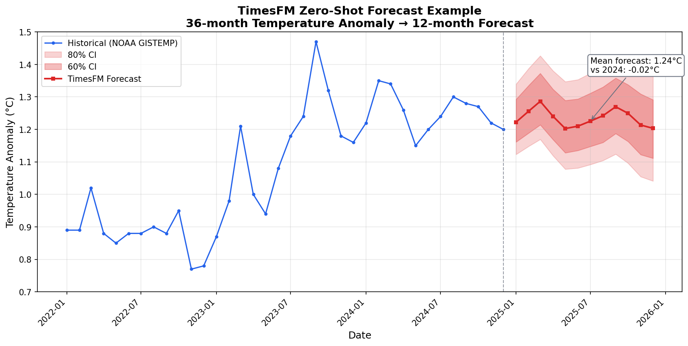

# TimesFM Forecast Report: Global Temperature Anomaly (2025)

**Model:** TimesFM 2.5 (200M) PyTorch
**Generated:** 2026-08-18
**Source:** NOAA GISTEMP Global Land-Ocean Temperature Index

---

## Executive Summary

TimesFM forecasts a mean temperature anomaly of **1.24°C** for 2025, essentially level with the 2024 average of 1.25°C. The model predicts a peak of 1.29°C in March 2025 and a shallow minimum of 1.20°C in May, with a second, smaller peak in September.

---

## Input Data

### Historical Temperature Anomalies (2022-2024)

| Date | Anomaly (°C) | Date | Anomaly (°C) | Date | Anomaly (°C) |
|------|-------------|------|-------------|------|-------------|
| 2022-01 | 0.89 | 2023-01 | 0.87 | 2024-01 | 1.22 |
| 2022-02 | 0.89 | 2023-02 | 0.98 | 2024-02 | 1.35 |
| 2022-03 | 1.02 | 2023-03 | 1.21 | 2024-03 | 1.34 |
| 2022-04 | 0.88 | 2023-04 | 1.00 | 2024-04 | 1.26 |
| 2022-05 | 0.85 | 2023-05 | 0.94 | 2024-05 | 1.15 |
| 2022-06 | 0.88 | 2023-06 | 1.08 | 2024-06 | 1.20 |
| 2022-07 | 0.88 | 2023-07 | 1.18 | 2024-07 | 1.24 |
| 2022-08 | 0.90 | 2023-08 | 1.24 | 2024-08 | 1.30 |
| 2022-09 | 0.88 | 2023-09 | 1.47 | 2024-09 | 1.28 |
| 2022-10 | 0.95 | 2023-10 | 1.32 | 2024-10 | 1.27 |
| 2022-11 | 0.77 | 2023-11 | 1.18 | 2024-11 | 1.22 |
| 2022-12 | 0.78 | 2023-12 | 1.16 | 2024-12 | 1.20 |

**Statistics:**
- Total observations: 36 months
- Mean anomaly: 1.09°C
- Trend (2022→2024): +0.37°C

---

## Raw Forecast Output

### Point Forecast and Prediction Intervals

Quantile columns are `[mean, q10, q20, ..., q90]`, so the 60% interval is `q20`-`q80` and the 80% interval is `q10`-`q90`.

| Month | Point | 60% PI | 80% PI |
|-------|-------|--------|--------|
| 2025-01 | 1.222 | [1.161, 1.293] | [1.123, 1.340] |
| 2025-02 | 1.256 | [1.189, 1.336] | [1.148, 1.388] |
| 2025-03 | 1.286 | [1.214, 1.373] | [1.169, 1.427] |
| 2025-04 | 1.240 | [1.169, 1.324] | [1.119, 1.381] |
| 2025-05 | 1.203 | [1.128, 1.289] | [1.078, 1.347] |
| 2025-06 | 1.210 | [1.135, 1.294] | [1.081, 1.353] |
| 2025-07 | 1.225 | [1.147, 1.311] | [1.092, 1.373] |
| 2025-08 | 1.242 | [1.160, 1.330] | [1.104, 1.395] |
| 2025-09 | 1.270 | [1.187, 1.358] | [1.124, 1.425] |
| 2025-10 | 1.250 | [1.163, 1.338] | [1.096, 1.410] |
| 2025-11 | 1.214 | [1.122, 1.309] | [1.055, 1.380] |
| 2025-12 | 1.203 | [1.111, 1.291] | [1.041, 1.370] |

### JSON Output

```json
{
  "model": "TimesFM 2.5 (200M) PyTorch",
  "input": {
    "source": "NOAA GISTEMP Global Temperature Anomaly",
    "n_observations": 36,
    "date_range": "2022-01 to 2024-12",
    "mean_anomaly_c": 1.09
  },
  "forecast": {
    "horizon": 12,
    "dates": ["2025-01", "2025-02", "2025-03", "2025-04", "2025-05", "2025-06",
              "2025-07", "2025-08", "2025-09", "2025-10", "2025-11", "2025-12"],
    "point": [1.222, 1.256, 1.286, 1.240, 1.203, 1.210, 1.225, 1.242, 1.270, 1.250, 1.214, 1.203]
  },
  "summary": {
    "forecast_mean_c": 1.235,
    "forecast_max_c": 1.286,
    "forecast_min_c": 1.203,
    "vs_last_year_mean": -0.017
  }
}
```

The full file, including all ten quantile columns, is at `output/forecast_output.json`.

---

## Visualization



---

## Findings

### Key Observations

1. **Plateau rather than continued rise**: the forecast mean sits 0.02°C below the 2024 mean. After the sharp 2022→2024 climb of +0.37°C, the model extrapolates a level year rather than either a further jump or a fall back.

2. **Seasonal pattern preserved**: the forecast keeps the late-winter high (March) and adds a secondary September peak, both of which are present in the 2023 and 2024 observations.

3. **Widening uncertainty**: the 80% interval grows from ±0.11°C in January to ±0.16°C in December (width 0.217 → 0.329), the usual growth of forecast uncertainty with horizon.

4. **Peak temperature**: March 2025 is the highest month at 1.29°C, still well below the September 2023 record of 1.47°C in the input data.

### Limitations

- TimesFM is a zero-shot forecaster without physical climate model constraints
- The 36-month context is short and cannot capture multi-decadal climate trends
- El Niño/La Niña cycles are not explicitly modeled

### Recommendations

- Use this forecast as a baseline comparison for physics-based climate models
- Update the forecast as new observations become available
- Consider ensemble approaches combining TimesFM with other methods

---

## Reproducibility

### Files

| File | Description |
|------|-------------|
| `temperature_anomaly.csv` | Input data (36 months) |
| `run_forecast.py` | Forecasting script |
| `visualize_forecast.py` | Fan chart visualization |
| `generate_animation_data.py` | Incremental forecasts for the animation |
| `generate_gif.py` | Animated GIF from the animation data |
| `generate_html.py` | Self-contained interactive HTML |
| `run_example.sh` | One-click runner (preflight, forecast, visualization) |
| `output/forecast_output.csv` | Point forecast with all quantiles |
| `output/forecast_output.json` | Machine-readable forecast |
| `output/forecast_visualization.png` | Fan chart |
| `output/animation_data.json` | Per-step forecasts driving the animation |
| `output/forecast_animation.gif` | Animated forecast |
| `output/interactive_forecast.html` | Interactive forecast |

### How to Reproduce

```bash
# Install dependencies
uv pip install "timesfm[torch]" matplotlib pandas numpy

# Run the complete example
cd timesfm-forecasting/examples/global-temperature
./run_example.sh
```

The model weights (~800 MB) download from Hugging Face on first use and cache in
`~/.cache/huggingface/`. The forecast itself runs in seconds on CPU.

---

## Technical Notes

### API

TimesFM 2.5 loads through `from_pretrained` and must be compiled with a `ForecastConfig`
before `forecast()` is called:

```python
import timesfm

model = timesfm.TimesFM_2p5_200M_torch.from_pretrained(
    "google/timesfm-2.5-200m-pytorch",
    torch_compile=False,
)
model.compile(timesfm.ForecastConfig(
    max_context=512,
    max_horizon=12,
    normalize_inputs=True,
    use_continuous_quantile_head=True,
    fix_quantile_crossing=True,
))

point_forecast, quantile_forecast = model.forecast(horizon=12, inputs=[values])
```

Two differences from the archived 1.0/2.0 API are worth noting when adapting older code:

- `TimesFmHparams`, `TimesFmCheckpoint` and `TimesFm` no longer exist, and 2.5 has no
  frequency indicator, so `freq=[0]` is gone.
- The quantile array is `[mean, q10, q20, ..., q90]`. Column 0 is the **mean**, not q10;
  q10 is at index 1 and q90 at index 9, and the median at index 5 equals `point_forecast`.

### Checkpoint format

The `google/timesfm-2.5-200m-pytorch` checkpoint ships as `model.safetensors` and loads
directly. Older notes describing a `torch_model.ckpt` requirement apply to the 1.0/2.0
loaders only.

---

*Report generated by the TimesFM Forecasting Skill*
