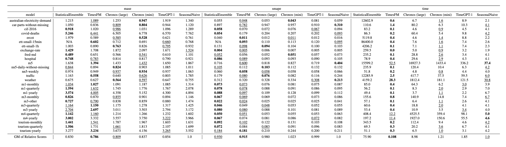

# Extended Benchmarks

The benchmark setting has been borrowed from Nixtla's original [benchmarking](https://github.com/AzulGarza/nixtla/tree/main/experiments/amazon-chronos) of time-series foundation models against a strong statistical ensemble. Later more datasets were added by the Chronos team in this [pull request](https://github.com/shchur/nixtla/tree/chronos-full-eval/experiments/amazon-chronos). We compare on all the datasets in this extended benchmarks.


## Running TimesFM on the benchmark

We need to add the following packages for running these benchmarks. Follow the installation instructions till before `poetry lock`. Then,

```
poetry add git+https://github.com/awslabs/gluon-ts.git
poetry lock
poetry install --only <pax or pytorch>
```

To run the timesfm on the benchmark do:

```
poetry run python3 -m experiments.extended_benchmarks.run_timesfm --model_path=google/timesfm-1.0-200m(-pytorch) --backend="gpu"
```


Note: In the current version of TimesFM we focus on point forecasts and therefore the mase, smape have been calculated using the quantile head corresponding to the median i.e 0.5 quantile. We do offer 10 quantile heads but they have not been calibrated after pretraining. We recommend using them with caution or calibrate/conformalize them on a hold out for your applications. More to follow on later versions.

## Benchmark Results for TimesFM-1.0



__Update:__ We have added TimeGPT-1 to the benchmark results. We had to remove the Dominick dataset as we were not able to run TimeGPT-1 on this benchmark. Note that the previous results including Dominick remain available at `./tfm_results.png`. In order to reproduce the results for TimeGPT-1, please run `run_timegpt.py`.

_Remark:_ All baselines except the ones involving TimeGPT were run performed on a [g2-standard-32](https://cloud.google.com/compute/docs/gpus). Since TimeGPT-1 can only be accessed by an API, the time column might not reflect the true speed of the model as it also includes the communication cost. Moreover, we are not sure about the exact backend hardware for TimeGPT. The TimesFM latency numbers are from the PAX version.

We can see that TimesFM performs the best in terms of both mase and smape. More importantly it is much faster than the other methods, in particular it is more than 600x faster than StatisticalEnsemble and 80x faster than Chronos (Large).

Note: This benchmark only compares on `one` small horizon window for long horizon datasets like ETT hourly and 15 minutes. More in depth comparison on longer horizon rolling validation tasks are presented in our long horizon benchmarks.