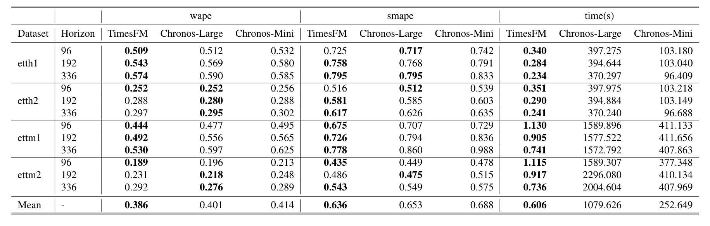

# Extended Benchmarks

We benchmark on the original test set for ETT datasets as per long horizon benchmark papers (see [here](https://openreview.net/forum?id=pCbC3aQB5W) for example.) In the original benchmark, rolling validation task on all test windows (with a stride of 1) is considered. While we can easily run our method on this task, the baselines can take a very long time to run. Therefore we present results on a modified task with stride between windows set to Horizon length i.e all disjoint horizons in the test period is considered.

All experiments were performed on a [g2-standard-32](https://cloud.google.com/compute/docs/gpus). We compare TimesFM with [Amazon-Chronos](https://github.com/amazon-science/chronos-forecasting).

## Running TimesFM on the benchmark

We need to add the following packages for running these benchmarks. Follow the installation instructions till before `poetry lock`. Then,

```
poetry add git+https://github.com/awslabs/gluon-ts.git
poetry add git+https://github.com/amazon-science/chronos-forecasting.git
poetry lock
poetry install --only pax
```
Note that for now only the pax version runs on this benchmark, because we had to remove the old tf dependency from the pytorch version. We will fix this issue soon.

To run the timesfm on the benchmark do:

```
poetry run python3 -m experiments.long_horizon_benchmarks.run_eval \
--model_path=google/timesfm-1.0-200m --backend="gpu" \
--pred_len=96 --context_len=512 --dataset=etth1
```

In the above, `<model_path>` should point to the checkpoint directory that can be downloaded from HuggingFace. 

For running chronos on the same benchmark you can run the command,

```
poetry run python3 -m experiments.long_horizon_benchmarks.run_eval \
--model_path=amazon/chronos-t5-mini --backend="gpu" \
--pred_len=96 --context_len=512 --dataset=etth1
```

You can change the model size from "mini" to "large" as required. The datasets we benchmark on are etth1, etth2, ettm1 and ettm2.

## Benchmark Results for TimesFM-1.0



We compare the performance on horizon lengths of 96, 192 and 336, while context length is held fixed at 512.

We can see that TimesFM performs the best in terms of both wape and smape. More importantly it is much faster than the other methods, in particular it is more than 1000x faster than Chronos (Large).